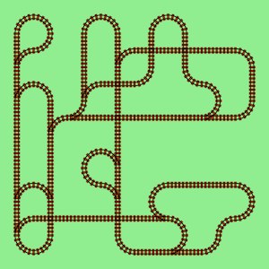
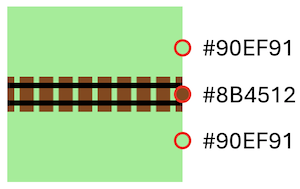
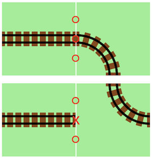

# Railroad Tracks

This service generates a simple railroad track map
using the _Wave Function Collapse_ algorithm as described by
[Oskar Stålberg](https://www.youtube.com/watch?v=0bcZb-SsnrA&t=350s).

For the implementation of the algorithm, we use [go-wfc](https://github.com/zfedoran/go-wfc).

## Getting started

To test the service, simple run `make run` and you should find the
result in the `output` directory.

```
% make run
mkdir -p ./output
go run main.go --run-once
INFO:   Image saved to: ./output/1733191573560971000.png

% open ./output/1733191573560971000.png
```



## Quick Explanation

In its simplest form, the _Wave Function Collapse_ algorithm tries to find a layout of $w x h$ cards
where adjacent tiles "match" up exactly on all sides. Matching is this implementation means that we
first calculate a _matching hash_ for each side of a tile and define that two tiles can be placed beside each other if the matching hash of the two touching sides is the same.

For our toy example, we pick three evenly spaced point on each side, take the respective RGB color
and hash them together into a single `ConstrainId` as shown below:



The following image shows two scenarios, one for a side-by-side match, and one where there is none.



All tiles used can be found in the [./tiles](./tiles) directory

## Turning into an IVCAP Service

To turn this program into an IVCAP service, we need to add the following:

* An HTTP `POST /` handler to accept a request, create an image and return it
* An HTTP `GET /_healtz` handler to indicate that the service is up
* A `Dockerfile` to dockerize the service
* A `service.json` file to describe the service


### HTTP Service

The following code snippet at the end of [main.go](./main.go) initialises and starts
a web server as well as implements the `/_healtz` endpoint

```go
fmt.Printf("INFO:\tListening on port %d\n", *port)
http.HandleFunc("/", handler)
http.HandleFunc("/_healtz", func(w http.ResponseWriter, r *http.Request) {
  w.Header().Set("Content-Type", "application/json")
  s := fmt.Sprintf("{\"version\": \"%s\"}\n", VERSION)
  w.Write([]byte(s))
})
if err := http.ListenAndServe(fmt.Sprintf(":%d", *port), nil); err != nil {
  fmt.Printf("ERROR:\tServer problem - %v'\n", err)
}
```

The actual service is implemented in the `handler` function:

```go
type Request struct {
 Width    int `json:"width,omitempty"`
 Height   int `json:"height,omitempty"`
 Attempts int `json:"attempts,omitempty"`
}

func handler(w http.ResponseWriter, r *http.Request) {
 if r.Method == "POST" {
  req := parse_request(w, r)
  if req == nil {
   return
  }
  images, err := load_tiles()
  if err != nil {
   http.Error(w, err.Error(), http.StatusInternalServerError)
   return
  }
  output, err := collapseWave(images, req.Width, req.Height, req.Attempts)
  if err != nil {
   http.Error(w, err.Error(), http.StatusInternalServerError)
   return
  }
  save_image(output, w)
  return
 } else {
  http.Error(w, "Method Not Allowed", http.StatusMethodNotAllowed)
 }
}
```

It parses the incoming request as defined per `Request`. An example of a valid request
can be found in [sample_request.json](./sample_request.json).

### [Dockerfile](./Dockerfile)

The Dockerfile packages this toy application into a Docker container which cna be uploaded to IVCAP.

The `make docker-build` target builds the container locally, `make docker-run` executes the application
inside the container and stores the result in the same location as `make run` (this assumes that your local file system can be easily mapped into the container)

To test the container in a context similar to IVCAP, first start the container as web server in one
terminal (`make docker-serve`). Then open a new terminal and run:

```bash
% make send-request

Status: 200
{"content-type":["image/png"],
"transfer-encoding":["chunked"]
}
result stored in ./output/2024-12-03T14:08:44+11:00.png
```

If everything works, feel free to upload the docker package with `make docker-publish`.

### [service.json](./service.json)

The [service.json](./service.json) file describes the service, the expected schema of both
the incoming request as well as the responding result.

```json
{
  "$schema": "urn:ivcap:schema.service.2",
  "$id": "#SERVICE_URN#",
  "name": "Railroad Tracks via Wave Function Collapse algorithm",
  "description": "This service generates a simple railroad track map ...",
  "policy": "urn:ivcap:policy:ivcap.base.service",
  "controller_schema": "urn:ivcap:schema.service.rest.1",
  "controller": {
    "$schema": "urn:ivcap:schema.service.rest.1",
    "type": "object"
    "command": [
      "/app/main",
      "--port",
      "8080"
    ],
    "port": 8080,
    "package_urn": "#PACKAGE_URN#",
    "ready_path": "/_healtz",
    "request": {
      "$schema": "https://json-schema.org/draft/2020-12/schema",
      "$id": "urn:sd.test:schema.railroad-collapse.request.1",
      "properties": {
        "width": {
          "default": 8,
          "description": "Number of tiles in x direction",
          "title": "Width",
          "type": "number"
        },
        ...
      },
      ...
     },
    "response": {
      "$schema": "urn:ivcap:schema:binary-response",
      "content-type": "image/png"
    }
  }
}
```

In order to deploy this service to IVCAP, run the `make service-register` target.